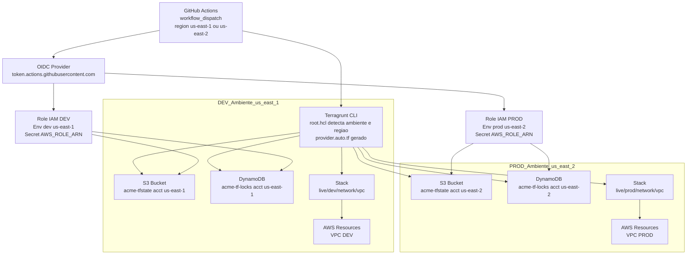

# 🌎 Terragrunt Multi-Ambiente (Dev/Prod) com GitHub Actions e Backend Remoto AWS

Este projeto demonstra uma **infraestrutura multi-ambiente (Dev e Prod)** provisionada via **Terraform + Terragrunt**, com **backend remoto em S3 e DynamoDB** e **pipeline GitHub Actions** totalmente automatizado, incluindo suporte a **assunção de roles via OIDC** e **seleção de ambiente por região** (`us-east-1` → Dev, `us-east-2` → Prod).

---

## 🗺️ Diagrama de Arquitetura

Este diagrama mostra o fluxo completo entre o **GitHub Actions (com OIDC)** e a **AWS**, onde:
- A seleção da região no input (`us-east-1` ou `us-east-2`) define automaticamente o ambiente (`dev` ou `prod`);
- O **Terragrunt** detecta o ambiente e gera dinamicamente os arquivos `backend.auto.tf` e `provider.auto.tf`;
- O **tfstate** é salvo em **buckets S3** distintos e com bloqueio de concorrência em **DynamoDB**;
- O **GitHub Actions** assume roles IAM diferentes para cada ambiente via **OIDC**, sem precisar de chaves fixas.


---

## 🧱 Estrutura de Diretórios

```bash
.
├── modules/                  # Módulos reutilizáveis (ex: VPC, IAM, S3, etc)
│   └── vpc/
│       ├── main.tf
│       └── variables.tf
│
├── live/
│   ├── dev/
│   │   ├── terragrunt.hcl    # Ambiente DEV (us-east-1)
│   │   └── network/
│   │       └── vpc/
│   │           └── terragrunt.hcl
│   │
│   └── prod/
│       ├── terragrunt.hcl    # Ambiente PROD (us-east-2)
│       └── network/
│           └── vpc/
│               └── terragrunt.hcl
│
├── root.hcl                  # Configuração global do Terragrunt
├── .github/
│   └── workflows/
│       └── terragrunt.yaml   # Pipeline CI/CD com input de região
└── README.md
```
* * *

## ⚙️ Terragrunt: Configuração Global (`root.hcl`)

O `root.hcl` define:

* O **backend remoto** (S3 + DynamoDB)
    
* O **mapeamento automático de região por ambiente**
    
* O **gerenciamento de locks e versionamento do state**
    

```hcl
locals {
  project     = get_env("PROJECT", "acme")
  environment = basename(dirname(dirname(get_original_terragrunt_dir())))
  region_map = {
    dev  = "us-east-1"
    prod = "us-east-2"
  }
  aws_region = try(local.region_map[local.environment], get_env("AWS_REGION", "us-east-1"))
  account_id = get_env("ACCOUNT_ID", get_aws_account_id())
}

remote_state {
  backend = "s3"
  generate = {
    path      = "backend.auto.tf"
    if_exists = "overwrite"
  }
  config = {
    bucket         = "${local.project}-tfstate-${local.account_id}-${local.aws_region}"
    key            = "states/${local.environment}/terraform.tfstate"
    region         = local.aws_region
    dynamodb_table = "${local.project}-tf-locks-${local.account_id}-${local.aws_region}"
    encrypt        = true
  }
}
```

* * *

## 🧩 Exemplo de Componente: VPC

### `live/dev/network/vpc/terragrunt.hcl`

```hcl
include "root" {
  path   = find_in_parent_folders("root.hcl")
  expose = true
}

locals {
  repo_root  = get_repo_root()
  aws_region = include.root.locals.aws_region
}

# Gera provider dinâmico
generate "provider" {
  path      = "provider.auto.tf"
  if_exists = "overwrite"
  contents  = <<EOF
provider "aws" {
  region = "${local.aws_region}"
}
EOF
}

terraform {
  source = "${local.repo_root}/modules/vpc"
}

inputs = {
  cidr_block  = "10.10.0.0/16"
  environment = "dev"
}
```

* * *

## 🧮 Backend Remoto (State Management)

* **Bucket S3**: `acme-tfstate-<ACCOUNT_ID>-us-east-1`
    
* **Tabela DynamoDB**: `acme-tf-locks-<ACCOUNT_ID>-us-east-1`
    

Os states são separados por ambiente:

```
s3://acme-tfstate-<ACCOUNT_ID>-us-east-1/states/dev/terraform.tfstate
s3://acme-tfstate-<ACCOUNT_ID>-us-east-2/states/prod/terraform.tfstate
```

* * *

## 🚀 Pipeline CI/CD (GitHub Actions)

O workflow (`.github/workflows/terragrunt.yaml`) realiza:

* **Autenticação via OIDC** (sem chaves fixas)
    
* **Seleção de ambiente automática** por região:
    
    * `us-east-1` → `dev`
        
    * `us-east-2` → `prod`
        
* Execução de **plan** ou **apply** com input manual:
    
    * `plan`: somente visualiza mudanças
        
    * `apply`: aplica as alterações
        

### Execução Manual (dispatch)

1. Vá até **Actions → Terragrunt (um input de região)**
    
2. Clique em **Run workflow**
    
3. Escolha:
    
    * `region`: `us-east-1` (Dev) ou `us-east-2` (Prod)
        
    * `action`: `plan` ou `apply`
        

* * *

## 🔐 Configuração de OIDC

1. Crie um **Identity Provider OIDC** no AWS IAM com:
    
    ```
    https://token.actions.githubusercontent.com
    ```
    
2. Adicione uma **Role IAM** com trust policy:
    

```json
{
  "Version": "2012-10-17",
  "Statement": [
    {
      "Effect": "Allow",
      "Principal": { "Federated": "arn:aws:iam::<ACCOUNT_ID>:oidc-provider/token.actions.githubusercontent.com" },
      "Action": "sts:AssumeRoleWithWebIdentity",
      "Condition": {
        "StringEquals": { "token.actions.githubusercontent.com:aud": "sts.amazonaws.com" },
        "StringLike": {
          "token.actions.githubusercontent.com:sub": "repo:<ORG>/<REPO>:*"
        }
      }
    }
  ]
}
```

3. Crie **Environments** no GitHub:
    
    * `dev` → secret `AWS_ROLE_ARN_DEV`
        
    * `prod` → secret `AWS_ROLE_ARN_PROD`
        

* * *

## 🧪 Execução Local

### Dev

```bash
cd live/dev/network/vpc
terragrunt run init -- -reconfigure
terragrunt run apply -- -auto-approve
```

### Prod

```bash
cd live/prod/network/vpc
terragrunt run init -- -reconfigure
terragrunt run apply -- -auto-approve
```

* * *

## 🧩 Tecnologias

| Categoria | Ferramenta | Função |
| --- | --- | --- |
| Infraestrutura | **Terraform** | Provisionamento declarativo |
| Orquestração | **Terragrunt** | Gestão de múltiplos ambientes |
| Backend remoto | **S3 + DynamoDB** | Armazenamento e locking do tfstate |
| CI/CD | **GitHub Actions** | Execução automatizada e segura |
| Autenticação | **OIDC (AWS IAM)** | Assunção de role sem secrets locais |

* * *

## 📚 Boas Práticas

* Cada módulo em `modules/` deve ser **idempotente** e **sem dependências externas**.
    
* Sempre rode `terragrunt validate` e `terraform fmt -check` antes do commit.
    
* Use **variáveis parametrizadas** via `inputs` nos HCLs de ambiente.
    
* Mantenha **os states separados** por ambiente e região.
    
* Configure **revisores obrigatórios** para o ambiente `prod` (aprovação manual antes do deploy).
    

* * *

## 📦 Próximos Passos

* Adicionar módulo de **subnets + route tables**
    
* Integrar **Karpenter** e **KEDA** em clusters EKS
    
* Implementar **notificações no Slack/Teams** após o apply
    
* Habilitar **terragrunt hclfmt** no CI para lint automático
    

* * *

## 🧑‍💻 Autor

**Claudio Martin Bianco**  
📌 _DevOps / Platform Engineer_  
💼 Infraestrutura como código • CI/CD • Kubernetes • AWS  
🔗 [LinkedIn](https://linkedin.com/in/claudiomartinbianco) | [GitHub](https://github.com/claudiomartinbianco)

* * *

> 🧠 _“Automatizar é multiplicar o tempo — cada deploy sem intervenção humana é uma vitória da engenharia.”_
